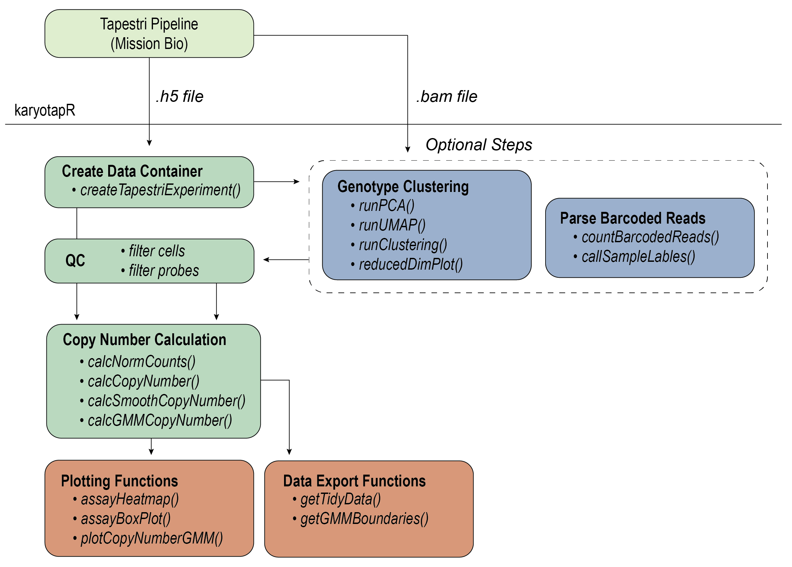

<!-- README.md is generated from README.Rmd. Please edit that file -->

# karyotapR

<!-- badges: start -->

[](https://github.com/joeymays/karyotapR/actions/workflows/R-CMD-check.yaml)
[](https://CRAN.R-project.org/package=karyotapR)
<!-- badges: end -->

karyotapR enables analysis of DNA copy number (aneuploidy) using data
produced by the KaryoTap method. Users can easily parse, manipulate, and
visualize datasets produced from the automated ‘Tapestri Pipeline’, with
support for normalization, clustering, and copy number calling.
Functions are also available to deconvolute multiplexed samples by
genotype and parsing barcoded reads from exogenous lentiviral
constructs.

KaryoTap combines custom genome-wide targeted DNA sequencing panels for
the Mission Bio Tapestri system with a Gaussian mixture model framework
for calling copy number.

## References

Mays JC et al., 2023. *KaryoTap Enables Aneuploidy Detection in
Thousands of Single Human Cells.*
<https://www.biorxiv.org/content/10.1101/2023.09.08.555746v1>.

## Installation

You can install the current stable version of karyotapR from
[CRAN](https://cran.r-project.org/package=karyotapR) with:

``` r
install.packages('karyotapR')
```

You can install the development version of karyotapR from
[GitHub](https://github.com/joeymays/karyotapR) with:

``` r
# install.packages("devtools")
devtools::install_github("joeymays/karyotapR")
```

## Workflow

For details on the workflow, see the [Getting
Started](https://joeymays.xyz/karyotapR/articles/karyotapR.html) guide,
articles on this site, and the package reference/documentation.


